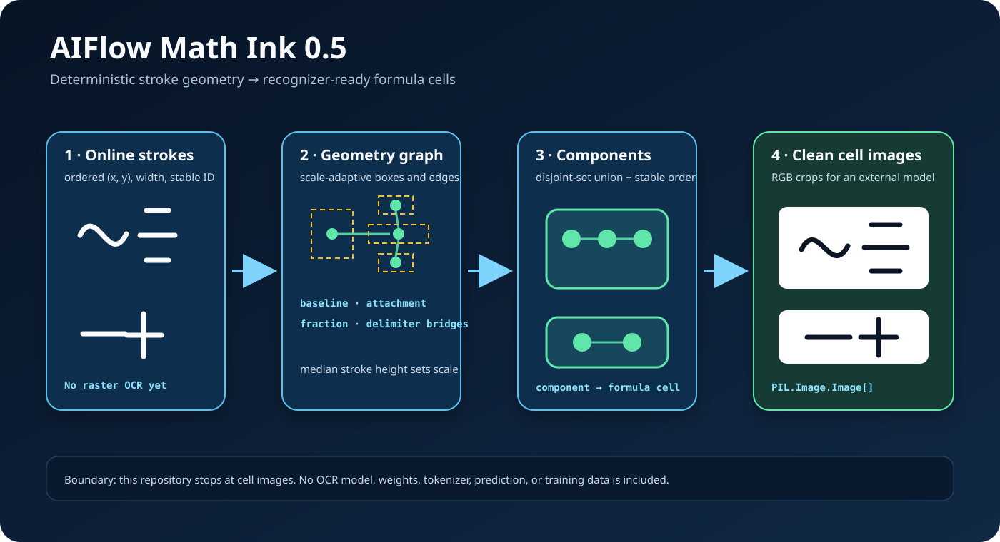

<div align="center">

# AIFlow E-ink

### Handwriting intelligence for quiet, low-power learning

[](https://huggingface.co/cwLeeDev)
[](https://github.com/kuseumkkrkkr)

</div>

AIFlow E-ink는 수학 필기 인식 모델과 E-ink 학습 인터페이스를 연결하기 위한 공개 자료 저장소입니다.

Hugging Face에 공개된 초기 모델 자료와 함께, AIFlow 1.0e까지의 코드·연구보고서·평가 결과·체크포인트를 보존합니다. 초기 공개 모델은 Hugging Face에서 내려받으며, 누적 연구 체크포인트는 이 저장소의 연구 스냅샷에 포함합니다.

<div align="center">



</div>

## Model Hub

| Model | Role | Source |
| --- | --- | --- |
| AIFlow Math Ink 0.5 | 수학 필기 전처리, stroke grouping, geometry 기반 초기 공개 모델 | [Hugging Face](https://huggingface.co/cwLeeDev/AIFlow-Math-Ink-0.5) |
| AIFlow Math Ink 0.6 Intermediate | point/stroke sequence 기반 온디바이스 연구 checkpoint와 Android 런타임 자료 | [Hugging Face](https://huggingface.co/cwLeeDev/aiflow-math-ink-06-intermediate) |

## Repository Map

| Path | Content |
| --- | --- |
| [`models/AIFlow-Math-Ink-0.5`](models/AIFlow-Math-Ink-0.5) | 0.5 모델 카드, 라이선스, 방법론 문서, 아키텍처 |
| [`models/aiflow-math-ink-06-intermediate`](models/aiflow-math-ink-06-intermediate) | 0.6 모델 카드, Android 문서, 모델 인덱스, 매니페스트, 아키텍처 |
| [`research`](research) | 연구 리포트, federation audit, 핵심 실험 요약 JSON, schema/config |
| [`models/DOWNLOADS.md`](models/DOWNLOADS.md) | Hugging Face 체크포인트와 artifact 다운로드 링크 |

## System Direction

```text
E-ink handwriting input
  -> stroke / point sequence capture
  -> Math Ink model inference
  -> formula and behavior understanding
  -> AIFlow learning feedback loop
```

## Related Repositories

| Repository | Purpose |
| --- | --- |
| [AIFlow-Core](https://github.com/kuseumkkrkkr/AIFlow-Core) | AIFlow 문제 생성과 검증 엔진 |
| [AIFlow-Eink](https://github.com/kuseumkkrkkr/AIFlow-Eink) | E-ink 학습 인터페이스와 Math Ink 모델 자료 |

## License Notes

- AIFlow Math Ink 0.5 자료는 원본 Hugging Face 저장소의 Apache-2.0 라이선스와 고지를 함께 보존합니다.
- AIFlow Math Ink 0.6 Intermediate 자료는 원본 Hugging Face 모델 카드, `NOTICE.md`, `MANIFEST.json`, `MODEL_INDEX.json`을 함께 보존합니다.
- 대용량 모델 바이너리는 GitHub가 아닌 Hugging Face 원본 저장소에서 내려받는 방식을 권장합니다.

## AIFlow 1.0e 연구보고서 — 2026-10-07

[AIFlow 1.0e 전체 연구 스냅샷](research/aiflow-1.0e/README.md)에 초기 연구, Selective-2D 후속 연구, CROHME 평가, 증강 모델 실험의 코드·보고서·실험 결과·체크포인트를 보존했습니다. 이 자료는 연구 기록이며 제품 채택 여부와 구분합니다. 대용량 연구 파일은 분할 압축으로 보존하며 복원 도구를 포함합니다.


누적 작업과 최근 V30–V33 실험은 [전체 연구보고서](research/aiflow-1.0e/README.md)에 경과·비교표·기각 결과·검증 한계와 원본 근거를 정리했습니다.

클라우드에서 V33을 복원·검증한 뒤 V34 gradient 진단과 V35 paired 학습을 완료했습니다. V35의 교사 정답 행만의 feature 보존은 수식 exact **64/149 → 62/149**, 개선 0식·회귀 2식으로 기각했습니다. 최종 모델·전체 학습 기록·독립 검증을 [V35 보고서](research/aiflow-1.0e/selective-2d/reports/TEACHER_CORRECT_FEATURE_V35_20261006.md)에 연결했고, [Linux CPU 설치·재현 지침](research/aiflow-1.0e/cloud/README.md)을 포함했습니다.

환경 복구 후 V37의 정확 재생 불일치를 보존하고, 동일 가설을 V38로 두 조건 각각 2,400단계 다시 학습했습니다. 학생의 가장 강한 경쟁 후보 하나를 보존하면 TRAIN 잔여 오류는 **6 → 2**로 줄었지만, 수식 exact는 **64/149 → 63/149**, Top-5 완전 포함은 **125/149 → 123/149**로 회귀했습니다. 새 조건은 기각하고 canonical을 유지합니다. [V38 완료·독립 검증 보고서](research/aiflow-1.0e/selective-2d/reports/CLOSEST_RIVAL_V38_20261007.md), [재현 명령](research/aiflow-1.0e/cloud/V38.md)

| 핵심 결과 | 저장된 연구 기록 |
| --- | --- |
| 누적 연구 | stroke 정규화·372-class HWR, 수식 문맥·배치, 교사 증류, Selective-2D, 실패 분석, 증강·경계·정답 유지 실험 |
| 최근 V33 | 근접 경쟁 후보 gap 유지 학습. V29 대비 소유 수식 Top-1 exact 62/149 → 64/149, Top-5 완전 포함 122/149 → 125/149 |
| 후속 V35 | 같은 CPU에서 두 조건 각각 2,400 step 완료. 내부 문자 +1에도 수식 exact 64/149 → 62/149로 새 조건 기각. Canonical 유지 |
| 최신 V38 | 두 조건 모두 cold canonical부터 다시 학습·검증. TRAIN 오류 감소에도 수식 exact 64/149 → 63/149, 개선 0식·회귀 1식으로 기각 |
| 기존 기준 | Canonical은 같은 소유 진단에서 76/149, 137/149로 V33보다 높아 유지. 제품 채택·배포 없음 |
| 기각 결과 | V31 숫자 sampling은 내부 숫자 개선에도 소유 수식 62/149 → 61/149로 비회귀 조건 실패 |
| 별도 전체 평가 | CROHME 1,199식 raw 평가에서 grouping exact 353식, 문자열 exact 59식, group·배치·관계·문자 동시 exact 50식 |

최근 수식 지표는 반복 관찰한 **정답 grouping 제공 진단**이고, Top-5 완전 포함은 최종 인식 정확도가 아닙니다. CROHME 수치는 비상업 로컬 proxy이며 공식 Expression Rate가 아닙니다. 새 작성자·실제 E-ink 기기의 독립 검증은 남아 있습니다.
