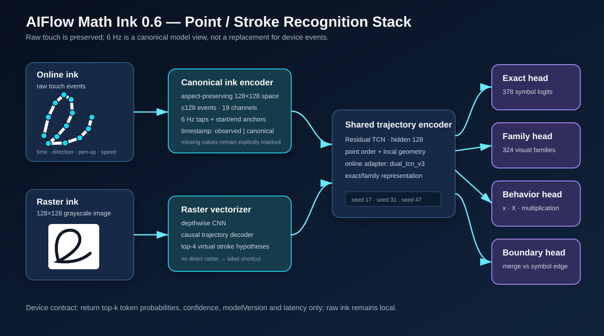
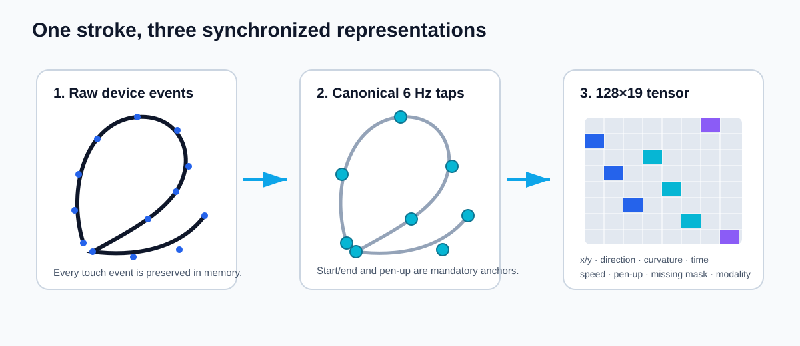

---
language:
  - ko
  - en
library_name: pytorch
license: other
pipeline_tag: feature-extraction
tags:
  - online-handwriting
  - mathematical-expression-recognition
  - trajectory
  - temporal-convolution
  - on-device
  - pytorch
---

# AIFlow Math Ink 0.6

AIFlow Math Ink 0.6은 수학 필기를 **이미지보다 point/stroke sequence로 먼저 처리하는** 온디바이스 연구 모델이다. 원본 touch event를 보존하면서 모델 입력만 6Hz canonical tap으로 재표본화하고, 각 고립 기호의 378-class top-k와 visual-family 확률을 반환한다.

현재 공개본은 seed 17·31·47의 연구 checkpoint와 grouping/behavior head를 포함한다. 전체 수식 LaTeX decoder나 완성된 Android LiteRT 배포본은 아니다.



## 2026-07-24 federation 감사

출처 이름이나 sample ID만 세지 않고, 이동·크기를 제거한 trajectory signature와 writer split을 다시 감사했다.

| 항목 | 교정 전 | 교정 후 |
|---|---:|---:|
| UJI Pen v1↔v2 중복 | 1,364 | 0 |
| HWRT writer split 누수 | 93명 | 0 |
| 전체 origin overlap | 0 | 0 |
| 유효 supervised source | 4 | 3 |

UJI Pen v1은 v2에 전부 포함된 mirror라 sampler에서 제거했다. HWRT 공식 test는 제품 경로에서 제외하고, 승인 train writer 275명을 별도의 train/validation/test로 다시 나눴다. UJI v2는 공식 test를 보존하면서 train writer validation을 격리했다.

현재 registry는 조사 `40/200`, 승인 배포 독립 그룹 `7/30`이다. 교정 후 seed-17 federation checkpoint에는 실제 `training_source_ids`와 독립 source group, registry SHA-256이 기록된다. 다만 30개 독립 승인 그룹·3-seed·P writer/device-disjoint release gate가 아직 없으므로 공개 모델은 계속 연구용이며 `product_validation=false`다. 교정 전 federation 정확도는 제품 근거로 사용할 수 없다.

교정 후 seed-17은 checkpoint에 실제 source ID·독립 그룹·registry SHA-256을 기록한다. UJI 전체 train을 포함한 15,829개 source-balanced 학습에서 test online top-1은 Pendigits/UJI v2/HWRT가 `93.2% / 71.8% / 84.0%`, raster top-1은 `42.8% / 41.0% / 74.4%`다. GTX 1650에서는 batch 32가 안정적이고 batch 64는 virtual top-4 peak OOM이었다.

이 결과는 출처 cap을 풀어도 UJI writer-generalization과 exact case family가 남는다는 근거다. Raster encoder·decoder만 여는 shadow run은 Pendigits를 개선했지만 HWRT holdout을 손상해 자동 guard에서 거부됐고 배포 모델에 포함하지 않는다. 3-seed distillation은 현재 보류 상태다.

Online affine(회전 ±10°·scale ±8%) full-source 1-epoch ablation도 validation macro online top-1 `88.57% → 88.07%`로 하락했고, UJI는 `80.00%`로 그대로인 반면 HWRT online/raster top-1은 `90.04/78.16% → 88.89/76.63%`가 됐다. 선택 결과는 기준선 epoch 0/alpha 0.0이므로 이 증강은 채택하지 않는다.

긴 GPU 실험에는 epoch-state를 남긴다. state에는 student/best/anchor model, Adam, source-balanced sampler generator, Python/NumPy/PyTorch/CUDA RNG이 포함되며 base SHA-256·seed·source·split contract가 모두 일치할 때만 resume한다.

동일 writer의 고립 glyph를 baseline anchor로 쓰는 size-resolver proxy도 UJI에서 `51.09% → 45.63%`, HWRT에서 `53.57% → 39.29%`로 악화됐다. 이는 writer 묶음이 실제 수식 행 문맥이 아니라는 반증이다. 따라서 relative-size resolver는 현재 isolated symbol output에는 적용하지 않고, P Formula의 실제 행/Tray context가 확보된 경우에만 다시 검증한다.

### 2026-07-25: 기각한 generalization loop와 재현성 보강

기하 일관 affine+raster-loss 후보는 좌표 변환 뒤 `shape/curvature/bbox/aspect/speed`도 다시 계산하도록 수정해 재검증했지만, source macro online이 `88.57% → 88.07%`, HWRT online/raster가 `90.04/78.16% → 88.89/76.63%`로 하락해 채택하지 않았다.

Cross-source same-label pair batch와 supervised contrastive loss(weight 0.05)도 연구용으로 검증했다. validation macro는 `88.57% → 89.23%`, UJI validation은 `80% → 82%`였으나 held-out UJI/HWRT online은 `−0.2/−0.4%p`, Pendigits raster는 `−3.2%p`였다. validation-only 상승은 배포 근거가 아니므로 이 checkpoint 역시 shadow로 격리했다.

이 반복에서 과거 stage-3 checkpoint가 현재 loader의 training selection으로 정확히 재현되지 않는 provenance 공백도 확인했다. 이후 trainer는 source별 선택 수와 `(source, sample_id, origin_id)` SHA-256을 checkpoint·report·epoch-resume contract에 넣어, 같은 표본 수이지만 다른 원본을 섞는 재개를 fail-closed로 막는다. `product_validation`은 계속 `false`다.

### Provenance baseline v1

새 seed-17 기준선은 정확히 기록된 15,829 training record(Pendigits 4,457 / UJI v2 5,372 / HWRT 6,000)와 sample-origin SHA-256 `fc103edba331d3682875171b04942a2028232a401a0ca72cd0b1c52da5608c91`를 사용한다. Held-out online top-1/top-5는 Pendigits `95.0/99.4%`, UJI `73.2/94.6%`, HWRT `84.2/99.0%`다. 전체 7,031개 online은 `86.06/97.50%`, visual-family `90.91%`, writer p10 `60.0%`다. 92/99 online, 90% raster, 30 independent P-source, 3-seed gate에는 모두 미달하므로 연구 기준선일 뿐 배포 모델이 아니다.

- [사람이 읽는 감사 보고서](reports/FEDERATION_AUDIT_20260724.md)
- [기계 판독 federation audit](reports/federation_audit.json)
- [교정 seed-17 full-source 결과](reports/federation_clean_seed17_fullsource_report.json)
- [전체 오류/혼동 감사](reports/federation_clean_seed17_error_audit.json)
- [full-source source별 오류·case proxy 감사](reports/federation_clean_seed17_fullsource_error_audit.json)
- [출처 registry](registry/math_ink_06_source_registry.json)

## 핵심 입력 계약



실제 펜 입력은 다음 순서로 처리한다.

1. 기기의 모든 touch event를 원본 timestamp와 함께 메모리에 보존한다.
2. stroke별 시작점·끝점·pen-up을 필수 anchor로 남긴다.
3. 모델용 temporal view만 6Hz로 재표본화한다.
4. 종횡비를 보존해 128×128 ink space에 중앙 정규화한다.
5. 최대 128 event, 19개 feature를 `128×19` tensor로 만든다.

19개 channel:

```text
shape_x, shape_y,
canvas_x, canvas_y,
direction_x, direction_y,
curvature, pen_up, stroke_progress,
aspect_ratio,
bbox_top, bbox_bottom, bbox_height, center_y,
baseline_available,
time_delta, speed, missing_mask, source_modality
```

- timestamp가 실제로 있으면 `timestamp_mode=observed`
- 정적 이미지처럼 시간이 없으면 `timestamp_mode=canonical`, `missing_mask=1`
- 추정 시간을 실제 관측 시간처럼 저장하지 않는다.

## 모델 구조

```text
Online stroke
  → 6 Hz canonical taps (128×19)
  → online dual-TCN adapter
  ────────────────────────────────────────────┐
                                               │
Raster 128×128                                 │
  → spatial encoder                            │
  → causal virtual-trajectory decoder          │
  → top-4 stroke hypotheses                    │
  ────────────────────────────────────────────┤
                                               ▼
                                shared residual TCN (hidden=128)
                                     ├─ exact head: 378 labels
                                     ├─ family head: 324 families
                                     └─ top-k probabilities

Local formula context + stroke tensor
  → 49-d context MLP + stroke TCN
  → identifier_lower / identifier_upper / multiply_operator

Segmentation lattice geometry
  → boundary behavior head
  → candidate crosses a symbol boundary?
```

Raster 경로도 최종 label shortcut을 사용하지 않는다. 이미지에서 top-4 virtual stroke를 만든 후 동일 trajectory encoder로 다시 인식한다.

## 공개 checkpoint

각 seed는 세 파일로 구성된다.

```text
models/
  seed17/
    base_378.pt
    online_adapter.pt
    behavior_role_head.pt
  seed31/
    ...
  seed47/
    ...
artifacts/
  boundary_behavior_guard.joblib
```

| 파일 | 역할 | 주요 계약 |
|---|---|---|
| `base_378.pt` | 공통 trajectory/raster base | hidden 128, top-4 hypothesis, 378 exact, 324 family |
| `online_adapter.pt` | 실제 온라인 stroke 보정 | `dual_tcn_v3`, `top4-skeleton-128x19` |
| `behavior_role_head.pt` | `x/X/×` 역할 문맥 | 128×19 stroke + 49 context feature |
| `boundary_behavior_guard.joblib` | 잘못된 다기호 병합 억제 | geometry 17 feature, threshold 0.5, weight 6 |

세 seed teacher를 그대로 모바일에 넣는 것이 최종 목표는 아니다. release 경로는 seed ensemble을 하나의 student로 distillation한 뒤 LiteRT INT8/FP16을 비교하는 것이다.

## Checkpoint metadata 확인

아래 코드는 network를 실행하지 않고 checkpoint 계약을 확인한다.

```python
from pathlib import Path
import torch

root = Path("models/seed17")

base = torch.load(root / "base_378.pt", map_location="cpu", weights_only=False)
adapter = torch.load(root / "online_adapter.pt", map_location="cpu", weights_only=False)
role = torch.load(root / "behavior_role_head.pt", map_location="cpu", weights_only=False)

print(base["model_version"])
print(base["max_events"], base["sample_hz"])
print(len(base["feature_names"]), len(base["exact_labels"]), len(base["family_labels"]))
print(adapter["adapter_architecture"], adapter["feature_contract"])
print(role["role_labels"], role["context_features"])
```

실제 Python composite 추론은 Colab bundle을 푼 디렉터리에서 다음처럼 실행한다. Adapter를 생략하면 정정된 메인 모델이 아니라 base-only 경로가 되므로 반드시 함께 전달한다.

```python
from pathlib import Path
from math_grid_drawer.research.math_ink_06 import MathInk06Engine

engine = MathInk06Engine(
    Path("artifacts/base_378.pt"),
    adapter_checkpoint=Path("artifacts/online_adapter.pt"),
)

result = engine.recognize_online(
    strokes,
    canvas_width=128,
    canvas_height=128,
    top_k=5,
)
```

Checkpoint 내부 경로는 lineage 기록이며 로컬 절대경로에 의존해 추론하지 않는다.

## 현재 성능

### 378-label trajectory classifier

최신 online case-context seed 17 기준:

| split | top-1 | top-5 | family top-1 |
|---|---:|---:|---:|
| writer validation, 4,261 samples | 86.13% | 99.48% | 92.94% |
| paired writer-disjoint test, 3,782 samples | 82.87% | 97.73% | 91.22% |

Paired source는 HWRT 내부 writer hash split과 UJI Pen v1/v2 writer-disjoint 계약을 사용했다. HWRT official test는 거대 writer 중복 때문에 제외했다.

### 수식 행동 head

정답 symbol grouping 이후의 CROHME 조건부 역할 평가:

| 지표 | 3-seed 평균 |
|---|---:|
| role accuracy | 93.33% |
| macro-F1 | 76.41% |
| lowercase identifier recall | 95.66% |
| uppercase identifier recall | 55.91% |
| multiplication recall | 88.89% |
| ECE | 4.88% |

행동 head를 실제 teacher 출력 뒤에 연결하고 validation에서만 confidence threshold를 선택한 결과, CROHME official test의 대상 기호 exact top-1은 33.65%에서 47.30%로 평균 **13.65%p** 상승했다. Rewrite precision은 81.35%였다. 다만 같은 구간의 teacher visual-family top-1이 53.02%에 불과해, 행동 문맥만으로 잘못된 형태군을 복구할 수 없었다.

### R-track 연속 수식 어댑터

제품 trajectory encoder와 online adapter는 고정하고, CROHME 연속식의 정답 symbol group 위에서 92KB zero-init formula adapter만 학습했다. 이 checkpoint는 구조 검증용 **R_noncommercial_only** 모델이며 제품 weight 또는 distillation 입력이 아니다.

| 3-seed 지표 | 평균 | 최저 |
|---|---:|---:|
| writer-validation exact top-1 | 85.19% | 82.91% |
| writer-validation visual-family top-1 | **93.30%** | **93.03%** |
| official test exact top-1 | 82.38% | 81.13% |
| official test visual-family top-1 | 88.17% | 88.03% |
| visual-family 일반화 gap | 5.13%p | — |

Validation에서는 세 seed 모두 형태군 92%를 넘겨 현재 TCN 구조가 연속 수식에도 적응할 수 있음을 확인했다. 반면 unseen official test에서는 모두 실패했다. 현 병목은 모델 용량보다 writer/source domain 일반화이며, 다음 gate는 상용 허용 P-track 연속식의 writer/device-disjoint 재학습이다.

### P 고립기호 합성 수식 proxy — 기각

승인 HWRT/UJI trajectory 1,590개를 숫자 anchor 사이에 합성 배치해 행동 head에 weight 0.35로 추가한 seed-17 실험은 accuracy가 93.07%로 같았지만 macro-F1 76.64→73.62%, uppercase recall 61.29→45.16%로 악화됐다. 실제 연속식 validation과 비교한 formula-relative bbox width/height의 최대 절대 SMD는 2.82로 호환 기준 0.5를 크게 넘었다.

고립기호에는 전체 formula bbox·Tray·이웃 부재 분포가 없으므로 임의 합성 배치를 행동/formula 제품 학습에 사용하지 않는다. 이 경로는 `rejected_no_3seed_expansion`이며 실패 checkpoint도 배포하지 않는다. 승인 고립기호는 shape encoder에만 유지하고, 행동 학습은 실제 `AIFlow P Formula v1` 연속식을 기다린다.

### Grouping boundary head

| 지표 | 이전 | boundary 적용 |
|---|---:|---:|
| CROHME exact partition | 60.04% | 60.25% |
| pair-F1 | 91.07% | 91.26% |
| overmerge formula rate | 21.72% | 20.49% |

### P boundary shared-state 정정

초기 공개 P delta는 `online_adapter.pt`의 `shared_state_dict`를 적용하지 않은 loader 결함을 상속했다. 이 때문에 강한 main encoder를 빠뜨린 낮은 기준선과 비교했으며, 해당 auxiliary/joint checkpoint와 성능 주장을 철회했다.

올바른 합성 순서인 `base → adapter shared state → modality adapter → optional head`로 세 seed를 다시 학습한 결과는 다음과 같다.

| paired proxy test | 정정된 main baseline | joint 결과 | 변화 |
|---|---:|---:|---:|
| exact top-1 | **83.03%** | 82.81% | -0.22%p |
| family top-1 | **91.37%** | 90.88% | -0.49%p |
| single-symbol recall | — | 92.83% | 95% floor 실패 |
| cross-boundary recall | — | 98.47% | 통과 |

세 seed 모두 release gate를 실패했으므로 joint delta는 배포하지 않는다. 현재 유효한 main 구성은 seed별 `base_378.pt + online_adapter.pt`이며 adapter 안의 `shared_state_dict`를 반드시 먼저 적용해야 한다.

Joint delta 없는 main+shadow auxiliary device stress에서 최악 exact/family 하락은 affine 변형의 -0.98%p/-1.08%p였다. Software stress는 통과했지만 clean single recall이 91.42~94.50%이므로 auxiliary head도 제품 채택 대상이 아니다.

### Composite torch.export

Export 그래프는 이제 base-only가 아니라 online/raster modality adapter와 shared state를 포함한다. 세 seed 모두 각 경로 대표 입력 76개에서 eager 대비 top-1 100% 일치, 최대 logit 절대오차 0.0을 기록했다. Validation-only calibration으로 고정된 online family-fusion 0.15도 export에 포함된다. Fresh seed-17 online/raster `.pt2` 합계는 24,300,116 bytes다.

`.pt2`는 Android용 `.tflite`가 아니다. LiteRT Torch 0.9.1 변환과 Android runtime parity는 아직 완료되지 않았으므로 `litert_exported=false`를 유지한다.

### CPU latency·memory proxy

Family-fusion 0.15를 포함한 Windows PyTorch CPU 재측정에서 online p95는 8.90~9.67ms, raster p95는 22.10~26.63ms였다. Tensor state는 8.95MB, 모델 로드 후 inference RSS 증가분을 합친 구조 proxy는 26.39MB다. 전체 Python process RSS는 PyTorch runtime을 포함하므로 Android LiteRT memory 근거가 아니다.

### Online 오류 합의 감사

정정 composite 세 seed를 선택에 쓰지 않은 paired writer/device-disjoint 3,782개에서 다시 감사했다.

| 지표 | 결과 |
|---|---:|
| exact ensemble top-1 | 83.71% |
| exact ensemble top-5 | 98.02% |
| visual-family top-1 | **92.99%** |
| seed oracle top-1 | 88.05% |
| 세 seed 공통 오류 | 11.95% |

Exact 오류의 56.98%(전체 9.28%p)는 `O/0/o`, 대소문자, 수직선·cross처럼 같은 visual family 안의 의미 혼동이다. 따라서 0.6의 trajectory 단계는 형태군 후보를 반환하고, exact 의미는 실제 수식 행의 상대 크기와 행동 문맥이 결정해야 한다. 실제 P 연속식이 없으므로 formula-context exact 92% gate는 아직 통과하지 않았다.

Validation에서 family-fusion 0.15를 선택한 뒤 paired-test에 한 번 적용하자 exact top-1은 83.71→83.82%(+0.11%p)였다. 이는 작은 보정이며 문맥 레이어를 대체하지 않는다.

## 출력 범위

의도한 모바일 API:

```text
recognizeOnline(strokes, canvas) → SymbolResult
recognizeRaster(bitmap)          → SymbolResult

SymbolResult:
  candidates[{token, probability}]
  confidence
  modelVersion
  latencyMs
```

이미지, raw stroke, virtual stroke는 서버 payload로 전송하지 않는다. virtual hypotheses는 로컬 debug에서만 노출한다.

## Local P Formula intake

Drawer의 local-only `AIFlow Ink v1`은 자동으로 학습 정답이 되지 않는다. 별도 human annotation JSONL이 실제 비식별 `device_id`, `label_status=human_verified`, 모든 `formula_cell_id → token` 전단사를 제공해야 한다.

Materializer는 다음 조건을 모두 통과한 뒤에만 UTF-8 P Formula v1 JSONL을 원자적으로 생성한다.

- 모든 raw stroke가 정확히 한 symbol group에 포함됨
- timestamp·pressure 결측을 원본 그대로 보존
- 기준 checkpoint의 중복 없는 378 exact vocabulary와 token 일치
- origin/writer/device/source split 누수 0
- training/validation/test와 P 권리·독립 source gate 통과

전체 AIFlow source checkout에서 실행한다.

```powershell
python scripts/materialize_math_ink_06_p_formula.py `
  --input path/to/curated `
  --annotations path/to/annotations.jsonl `
  --checkpoint path/to/base_378.pt `
  --output path/to/p_formula_v1.jsonl `
  --report path/to/preflight.json
```

실패 시 report만 남고 dataset은 생성되지 않는다. 이 기능은 서버 전송이나 자동 수집을 수행하지 않는다.

### P-only formula adapter training

Materialize된 P Formula v1은 전체 formula bbox 기준 128×19 symbol tensor로 변환된다. Product encoder와 online adapter는 동결하고 hidden-64 zero-init formula adapter만 학습한다.

```text
family CE + exact CE×0.10
context dropout 0.30
inverse-sqrt(source frequency × exact-label frequency) sampler
validation-only checkpoint selection
```

각 seed는 test exact top-1 92%, top-5 99%, macro-F1 90%, writer floor 75%, 결측 metadata slice 하락 3%p 이하를 모두 통과해야 한다. Seed 17·31·47이 개별 통과하고 세 run의 원본 P Formula JSONL SHA-256이 정확히 같은 경우에만 single mobile student distillation을 허용한다. Teacher ensemble 자체는 기기에 탑재하지 않는다.

실제 seed-17 composite와 GTX 1650을 사용한 1-epoch fixture smoke에서 CUDA 학습부터 report/checkpoint 생성까지 통과했다. Fixture checkpoint는 성능 근거가 아니므로 이 공개 저장소에 포함하지 않았다. 고정 recipe는 [`configs/MATH-INK-06-P-FORMULA-v1.json`](configs/MATH-INK-06-P-FORMULA-v1.json)에 있다.

### Single-student distillation

통과한 세 teacher는 base → shared online adapter → P formula adapter 순서로 합성한다. Temperature 2.0의 exact/family 확률을 seed 사이에서 평균하고 KL + hard-label CE로 hidden-64 formula adapter 하나만 학습한다. Student checkpoint에는 teacher weight를 포함하지 않는다.

Student는 자체 92/99·macro-F1·writer/missing gate뿐 아니라 teacher ensemble 대비 exact top-1·top-5·visual-family 하락 1%p 이하를 모두 만족해야 한다. 2/2/2-symbol fixture의 3-teacher→student CUDA 실행 경로는 통과했지만 정식 student gate는 실패했다. Fixture와 checkpoint는 이 공개 저장소에 없으며, 실제 P 데이터 성능이나 제품 검증을 뜻하지 않는다. LiteRT 변환도 아직 수행하지 않았다.

### Fail-closed release and export

`run_math_ink_06_p_formula_release.py`는 seed 17/31/47 학습·개별 gate, 동일 data SHA-256 요약, single-student 증류, student export를 순서대로 실행한다. 한 단계의 정식 gate가 실패하면 다음 단계는 실행하지 않는다.

Student export는 `online adapter → formula adapter → shared classifier → family fusion` 순서를 graph에 포함한다. P track·세 teacher lineage·동일 corpus·teacher weight 미포함을 다시 확인하고, 실제 P test representative에서 strict eager/export top-1 100%, logit 최대 오차 0.02 이하, graph 25MB 이하를 요구한다. 실패 fixture는 정식 export에서 거부된다. 378-label 메모리 graph의 strict export 호환성은 top-1 2/2·오차 0으로 확인했지만 실제 LiteRT/Android 검증은 아니다.

### Android ODA runtime

`android/aiflow-math-ink-runtime`은 `recognizeOnline`, `recognizeRaster`, `SymbolResult`와 AIFlow Ink v2의 raw stroke·6Hz tap·128×19 계약을 구현한다. Server payload에는 후보·confidence·model version·latency만 포함된다.

Android canonicalizer는 Python 대표 4행×19채널과 절대오차 `1e-4` 이내 parity를 통과했다. 최신 standalone LiteRT `CompiledModel` 2.1.6으로 APK asset의 online/raster graph를 직접 실행하며 ML Kit custom model API를 사용하지 않는다.

Raster 배포 graph는 exact logits뿐 아니라 top-4 coordinates/state logits/progress/hypothesis scores를 포함한 정확히 5개 output을 요구한다. `recognizeRasterDebug`는 이 값을 로컬에만 노출하고 server payload에는 포함하지 않는다. 실제 seed-17 378-label·76 representative strict export에서 online/raster top-1 76/76, 최대 오차 0.0과 다섯 output shape를 확인했다.

이 저장소의 Colab ZIP은 공개 가능한 `R_public_conversion_only` 연구 graph다. P student와 P corpus를 포함하지 않으며 product bundle이 아니다. 제품용 builder는 별도로 제공하지만 생성물에는 P data가 들어가므로 public upload와 server 전송이 금지된다. 새 P student는 base·online adapter SHA-256까지 checkpoint lineage로 가져야 한다.

3-tier benchmark runner는 동일 online/raster SHA-256 쌍의 representative로 warm-up 후 각 100회, PSS, battery charge-counter delta를 측정한다. 개별 hash는 순서가 고정된 bundle SHA-256으로도 묶는다. Python 요약기는 low/mid/high가 정확히 하나씩이고 version·개별 hash·bundle hash가 동일할 때만 online p95 50ms, raster p95 200ms, PSS 100MiB, battery 계측 gate를 AND로 결합한다. 최종 product manifest는 P 3-seed, 배포 raster 품질, LiteRT model pair, Android 3-tier의 동일 lineage를 다시 확인한다. Kotlin unit test 8개와 전체 Python 회귀 355개, release AAR build가 통과했다. AAR은 84,436 bytes, SHA-256 `2c65d4af59af1204fad66eff15bec5ef125dfa242da82d05b0e85cf99504c44d`이며 모델을 포함하지 않는다. 실제 flatbuffer·기기 benchmark 값은 아직 없다.

## 알려진 한계

- 378-label paired writer/device-disjoint top-1 목표 92%에 아직 미달한다.
- 전체 수식 LaTeX, Tray decoder, gridding은 0.7 범위다.
- uppercase 역할 recall과 `O/0`, styled-letter hard family가 남은 병목이다.
- 행동 exact gate는 유효하지만, 연속식 teacher 형태군이 틀리면 역할 head가 복구할 수 없다.
- R-track formula adapter는 validation 형태군 93.30%를 달성했으나 official test 88.17%에 그쳐 제품 검증을 통과하지 못했다.
- 승인 P 고립기호 합성 행동 proxy는 layout SMD 최대 2.82와 uppercase recall 하락 때문에 기각했다.
- raster virtual-stroke 경로는 digit/Greek slice에서는 개선됐지만 378-label release gate를 통과하지 못했다.
- boundary/behavior/formula adapter는 CROHME R-track 학습물이므로 제품 weight로 distill할 수 없다.
- P boundary auxiliary/joint는 shared-state 정정 후 세 seed release gate를 실패해 checkpoint를 철회했다.
- Device stress는 채택되지 않은 shadow auxiliary의 software perturbation 결과이며 실제 stylus/device-disjoint 성능 근거가 아니다.
- Android LiteRT 변환, PyTorch/LiteRT logit parity, 저가·중급·고급 기기 benchmark가 남아 있다.

## 데이터와 권리

이 저장소에는 원본 필기 데이터, 이미지, OCR cache를 포함하지 않는다.

- HWRT database: ODbL-1.0 취급, attribution 및 파생 database 검토 필요
- UJI/Pendigits 계열: 각 원 출처 조건을 별도로 따라야 함
- CROHME/MathWriting: 비상업 R-track 평가 또는 연구 head에만 사용
- checkpoint와 report는 현재 **research-only / non-commercial** 공개물이다.
- 상용 checkpoint는 권리 검토를 통과한 P-track 데이터로 처음부터 재학습해야 한다.

이 공개는 제품 정확도·상용 배포 가능성·LiteRT 호환성을 보증하지 않는다.

## 보안

PyTorch checkpoint와 joblib/pickle은 신뢰할 수 없는 출처에서 로드하면 임의 코드를 실행할 수 있다. `MANIFEST.json`의 SHA-256을 확인하고 신뢰된 환경에서만 사용한다.

## 연구 자료

- 전체 기술 보고서: [`reports/RESEARCH_REPORT.md`](reports/RESEARCH_REPORT.md)
- boundary 학습 결과: [`reports/boundary_behavior_guard_report.json`](reports/boundary_behavior_guard_report.json)
- 3-seed 행동 head: [`reports/behavior_role_3seed_summary.json`](reports/behavior_role_3seed_summary.json)
- P boundary 정정 3-seed: [`reports/p_boundary_joint_sharedfix_3seed_summary.json`](reports/p_boundary_joint_sharedfix_3seed_summary.json)
- 정정 main device stress: [`reports/p_boundary_device_stress_sharedfix_3seed.json`](reports/p_boundary_device_stress_sharedfix_3seed.json)
- Seed-17 composite export: [`exports/seed17/export_manifest.json`](exports/seed17/export_manifest.json)
- Composite CPU benchmark: [`reports/composite_cpu_benchmark.json`](reports/composite_cpu_benchmark.json)
- Online 3-seed 오류 합의: [`reports/online_error_consensus_paired_test_3seed.json`](reports/online_error_consensus_paired_test_3seed.json)
- Online family-fusion calibration: [`reports/online_family_fusion_calibration_3seed.json`](reports/online_family_fusion_calibration_3seed.json)
- 행동 exact gate 3-seed: [`reports/behavior_exact_gate_3seed.json`](reports/behavior_exact_gate_3seed.json)
- 수식 context 계약 감사: [`reports/formula_context_contract_3seed.json`](reports/formula_context_contract_3seed.json)
- R-track 수식 어댑터 3-seed: [`reports/formula_adapter_h64_3seed_summary.json`](reports/formula_adapter_h64_3seed_summary.json)
- P 합성 행동 proxy seed-17 실패: [`reports/behavior_role_p_proxy_w035_seed17.json`](reports/behavior_role_p_proxy_w035_seed17.json)
- P 합성 배치 분포 감사: [`reports/p_proxy_shift_seed17.json`](reports/p_proxy_shift_seed17.json)
- LiteRT Colab notebook: [`colab/AIFlow_Math_Ink_06_LiteRT.ipynb`](colab/AIFlow_Math_Ink_06_LiteRT.ipynb)
- 실제 P formula schema: [`contracts/aiflow_p_formula_v1.schema.json`](contracts/aiflow_p_formula_v1.schema.json)
- P formula 사람 annotation schema: [`contracts/aiflow_p_formula_annotation_v1.schema.json`](contracts/aiflow_p_formula_annotation_v1.schema.json)
- P-only formula 학습 recipe: [`configs/MATH-INK-06-P-FORMULA-v1.json`](configs/MATH-INK-06-P-FORMULA-v1.json)
- P-only formula student distiller: [`scripts/distill_math_ink_06_p_formula_student.py`](scripts/distill_math_ink_06_p_formula_student.py)
- P-only formula student exporter: [`scripts/export_math_ink_06_p_formula_student.py`](scripts/export_math_ink_06_p_formula_student.py)
- Fail-closed P release driver: [`scripts/run_math_ink_06_p_formula_release.py`](scripts/run_math_ink_06_p_formula_release.py)
- Android ODA runtime source: [`android/README.md`](android/README.md)
- 파일 checksum: [`MANIFEST.json`](MANIFEST.json)
