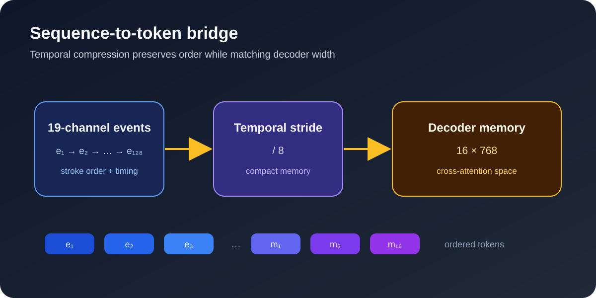

---
language:
- ko
- en
library_name: pytorch
tags:
- online-handwriting
- mathematical-expression-recognition
- sequence-to-sequence
---

# Online handwritten mathematics recognition

## Concept

This checkpoint represents mathematical handwriting as an ordered pen-trajectory sequence. It preserves stroke order and temporal structure, converts the sequence into compact memory tokens, and maps those tokens to a free-form mathematical text decoder.

The raster encoder is used only as an offline teacher while fitting the bridge. It is not part of the runtime path.

## Functions

- Read ordered online ink directly without rasterization.
- Encode trajectory shape and timing through the online prior.
- Compress the sequence into 16 temporal memory tokens.
- Project the memory into the decoder cross-attention space.
- Produce free-form LaTeX mathematical text.
- Use a raster-derived latent target during fitting while keeping raster-free runtime inference.

## Input and output

- Input: ordered raw strokes, up to 128 events, 19 trajectory channels.
- Output: free-form LaTeX text.
- Checkpoint: `serial_bridge.pt` contains the online adapter, sequence bridge, and tuned decoder cross-attention weights.
- Runtime assembly: the matching decoder base and the checkpoint are loaded together.

